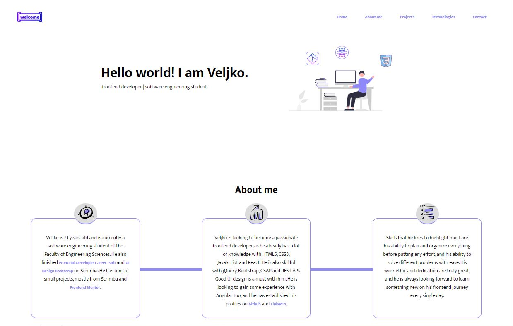
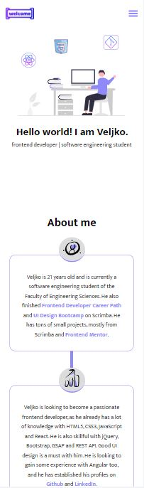

# My Portfolio

My own, simple portfolio webpage, which shows some basic information about me, my technologies stack, all my projects so far, which can be filtered by tags they contain, and an awesome contact illustration, which has links to my social media profiles and my email address.

## Table of contents

- [Overview](#overview)
  - [Screenshot](#screenshot)
  - [Links](#links)
- [Process](#process)
  - [Built with](#built-with)
  - [Useful resources](#useful-resources)
- [Author](#author)

## Overview

Users should be able to:
- access different sections of the page through nav menu 
- play a fun intro animation at the Home section, by clicking the 'Let me introduce myself' button
- read three paragraphs which display some basic information about me
- see all my project cards, and an option to filter projects based on selected tag
- see my technologies stack
- access my social media profiles via icons on the illustration in Contact section
- copy my email address by clicking the letter icon on the illustration

### Screenshot

Desktop and mobile design of My Portfolio.

### Links

- Live Site URL: [My Portfolio](https://jelenkoo10.github.io/my-portfolio/)

## Process

### Built with

- Semantic HTML5 markup
- CSS custom properties
- Flexbox
- CSS Grid
- CSS Animations
- Mobile-first workflow
- [React](https://reactjs.org/) - JS library
- [GSAP](https://greensock.com/docs/) - Animation library

### Useful resources

- [Image mapping tool](https://www.image-map.net/) - This helped me implement links of my social media profiles into an image, through mapping. I really liked this pattern and will use it going forward.

## Author

- GitHub - [https://github.com/jelenkoo10](https://github.com/jelenkoo10)
- Frontend Mentor - [@jelenkoo10](https://www.frontendmentor.io/profile/jelenkoo10)
- LinkedIn - [Veljko Jelenković](https://www.linkedin.com/in/veljko-jelenkovi%C4%87-182981250/)
